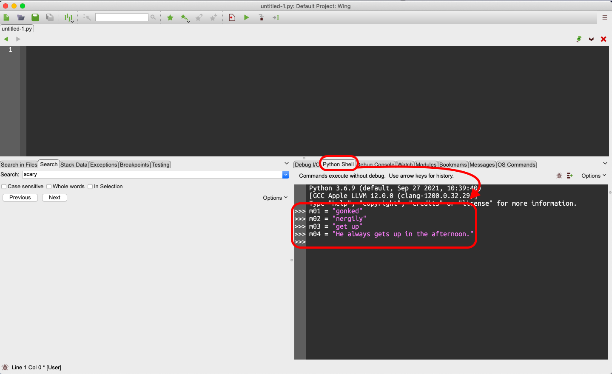
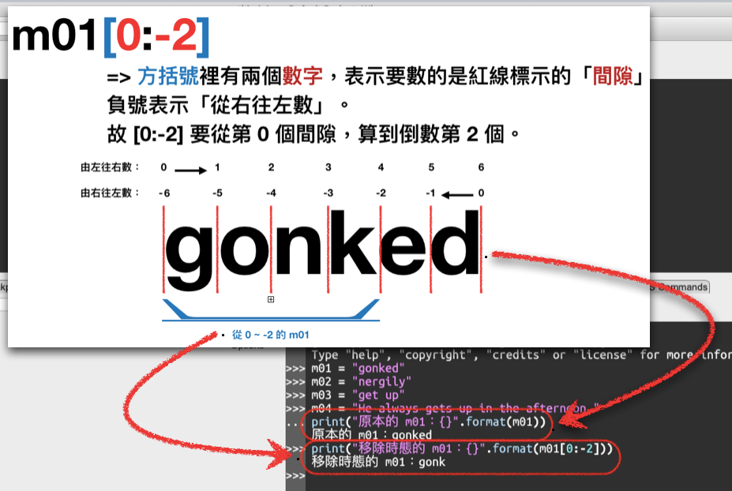

# Form: Data/Info in Languages
本系列的練習裡，將透過實際操作 Python 程式語言來理解「自然語言」裡的資料/資訊，在程式語言裡是如何呈現的。程式能力很像騎腳踏車或是游泳，如果你想確實掌握的話，一定要親手試試看哦！

如果在實作的過程中遇到任何問題，歡迎你到我們的 Discord 伺服器的 #nlp 頻道裡提問哦！
[連結：https://discord.gg/g5Enb5zAyK](https://discord.gg/g5Enb5zAyK)

## 練習目標：
Python 有幾個內建的資料型式 (data type)，分別詳列如下：
1. 「字串」(string type)
2. 「數字」(number type)
	- 整數型 (integer number, int)
	- 小數型 (floating number, float)
3. 「列表」(list type)
4. 「元組」(tuple type)
5. 「字典」(dictionary type)

本週的練習將著重在運用語言學來操作文本資料 (text data) 時最常使用的「字串」。

## 說明：
「字串」顧名思義就是「一串字」的意思。但在電腦程式的眼裡，它並不知道什麼是一個「字 (word)」，它只知道一個一個的「字符 (character)」。

如同我們在 Week01 的課堂中討論的「什麼是一個字？」(What makes a word?) 的問題。在英文裡，乍看之下好像很好理解。只要一串字符放在一起，有獨立的意義，就是一個 "word"。

例如：
> 第一個字：gonked  
> 第二個字：nergily  
> 第三個字：get up  

看到第三個字的時候，我們可以發現，「獨立的意義」這個定義似乎有點模糊。畢竟 "He always gets up in the afternoon." 這一串符號也是有獨立且不同於另一串符號 "She sometimes goes to bed late." 的意義呀！

事實上，在語言學裡，"What makes a word" 可透過疑問句的位移律 (transformation rules) 來進行確認。但對程式語言來說，我們就可以有以下的操作來表示「一個字串」：

首先在 VirtualBox 裡啟動你的 NLP_TrainingLab 開發環境，然後打開 Wing Personal 8，並在右下角找到 [Python] 的分頁，輸入以下的內容：

```python
m01 = "gonked"      #輸入左側「井號」之前的文字。輸入完後鍵入 'Enter' 鍵換行。  
m02 = "nergily"      #對 Python 而言，任何以 # 符號以後的東西都會被忽略，故可做為註解說明文字使用。
m03 = "get up"  
m04 = "He always gets up in the afternoon."    
```
 
注意到我們加了一個 m01 表示「第一個被記住的字串 (memorized_string_01)」，此外，我們加上一個等號 `=` 把右邊的字串存入 m01~m04 裡。換言之，我們把 "butterfly" 這個字串，用引號括起來，存入 m01 裡；用引號把 "soup" 這個字串括起來，存入 m02 裡，也用一樣的操作方式把 "get up" 和 "He always gets up in the afternoon." 分別存入 m03 和 m04 裡。

執行完後，你會得到如下的畫面：


我們首先注意到的是，m01 這個字串的最後兩個字符是英文的時態詞綴 `-ed`，如果想要把它拿掉的話，我們可以這麼做：

```python
...(承續前面的程式碼)
print("原本的 m01：{}".format(m01))             #使用 print() 函式，我們先看看 m01 是什麼樣子
print("移除時態的 m01：{}.format(m01[0:-2))      #使用 m01[0:-2]，表示把 m01 的內容從第 0 個間隙位置一路算到「到數第二個間隙位置」
```

其原理如下圖所示：


## 練習 w02_01：
> 請把以下的 "glonk" 的變形，還原成它的原形 "glonk"：  
> 1. He glonks every morning.  
> 2. I was disglonking this morning, too.

```python
word01 = "glonks"
word02 = "disglonking"
word01_org = None   #請把 None 改成你的答案。
word02_org = None   #請把 None 改成你的答案。
print(word01_org)      #你的答案應該能讓這一行印出 glonk
print(word02_org)      #你的答案應該能讓這一行印出 glonk
```
除了取得「原型」以外，我們也可以利用 `+` 這個符號，對兩個字串進行「串接」的操作。這個功能在為詞根加上詞綴時特別好用。比如說，我們已有 `nergily` 這個詞彙，而我們想要把它變為原形。這時候我們可以這麼操作：

```python
m02 = "nergily"    #別忘了，遇到 = 等號的時候，從右邊開始讀起。
m02 = m02[0:-2]    #先去除 -ly 的副詞詞綴。我們把 m02[0:-2] 去除 -ly 的計算結果 nergi 再度命名為 m02
m02 = m02[0:-1]    #再去除詞尾的 i。我們把 m02[0:-1] 去除 -i 的計算結果 nerg 再度命名為 m02
m02 = m02 + "y"    #再把 "nerg" 加上 "y" 
print(m02)         #此時就可以得到新的 m02 為 "nergy" 了
```

以上是依詞綴的變形律操作的，在撰寫程式時，我們可以把幾個步驟整併起來：

```python
m02 = "nergily"
m02 = m02[0:-3] + "y"   #藉由把 [0:-2] 和 [0:-1] 結合起來一次做掉，再加上 "y" 的操作
print(m02)              #此時就可以得到新的 m02 為 "nergy" 了
```
## 練習 w02_02：
> 請把以下的 "nergier" 的變形，還原成它的原形 "nergy"：  
> 1. I am feeling nergier every minute.

```python
word03 = "nergier"
#請在接下來的幾行內把 word03 透過字串操作，依英文的構詞律 (morphological rules) 改成 nergy。


print(word03_org)      #你的答案應該能讓這一行印出 nergy
```

## 額外練習：
Python 還有幾個內建的字串工具，可以把字串變成「全大寫」、「全小寫」、「句首大寫」或是「首字大寫」。試著動手操作看看：

```python
text01 = "I will always find you."
#全小寫 STR.lower()  STR 的意思是「放一個字串在這個位置。
text01_lowerCase = text01.lower()
print(text01_lowerCase)

#全大寫 STR.upper()
text01_upperCase = text01.upper()
print(text01_upperCase)

#句首大寫 STR.capitalize()
text01_cap = text01.capitalize()
print(text01_cap)

#首字大寫 STR.title()
text01_title = text01.title()
print(text01_title)
```
