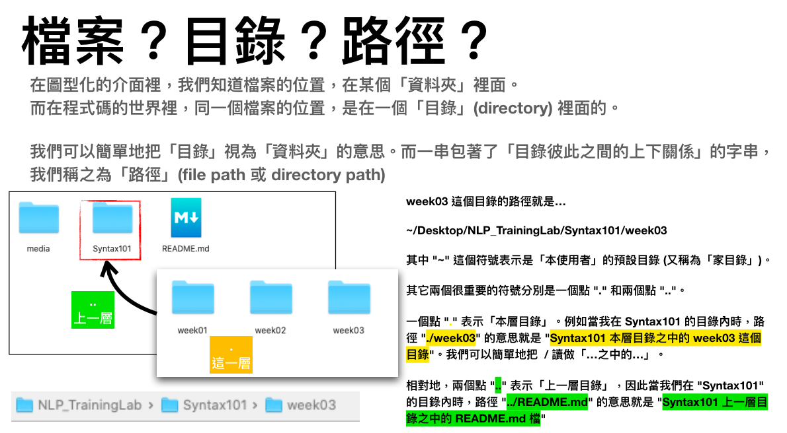

# Form: Data/Info in Languages
本系列的練習裡，將透過實際操作 Python 程式語言來理解「自然語言」裡的資料/資訊，在程式語言裡是如何呈現的。程式能力很像騎腳踏車或是游泳，如果你想確實掌握的話，一定要親手試試看哦！

如果在實作的過程中遇到任何問題，歡迎你到我們的 Discord 伺服器的 #nlp 頻道裡提問哦！
[連結：https://discord.gg/g5Enb5zAyK](https://discord.gg/g5Enb5zAyK)

## 練習目標：
Python 有幾個內建的資料型式 (data type)，分別詳列如下：
1. 「字串」(string type)
2. 「數字」(number type)
	- 整數型 (integer number, int)
	- 小數型 (floating number, float)
3. 「列表」(list type)
4. 「元組」(tuple type)
5. 「字典」(dictionary type)

本週的練習將延續上週的重點，運用語言學來操作文本資料 (text data) 時最常使用的「字串」的輸入、讀取檔案以及寫入檔案。

## 說明：
從本週開始，我們將會動手撰寫「完整」的一支程式。而一支完整的 Python 程式，是具有「檔頭」、「程式進入點」以及「函式」三個部份的。

一支 Python3 的程式一開始時，是長這樣的…

```python
#!/usr/bin/env python3
# -*- coding:utf-8 -*-

def main():
    return None
    
if __name__ == "__main__":
    main()
```

上面這段程式碼裡，就包含了..  

#### 1. 檔頭：告訴電腦這是一支 Python3 的程式！  

```python
#!/usr/bin/env python3
# -*- coding:utf-8 -*-
```

#### 2. 函式 main() ！
函式是 "function" 的中文譯名，它定義了在呼叫 main() 的時候，要做什麼事。你可以理解成家裡有一個「管家」，他的名字叫 main()，每次你有什麼事要處理的話，就會呼叫這個 main()，然後給予他足夠的任務指示，讓他去執行。

```python
def main():
    answerSTR = "What's up?"
    return answerSTR
```
依上面的說明，目前這個 main() 只會做一件事，就是回應你 "answerSTR"。而因為 "answerSTR" 的值被定義為 "What's up?"。因此每次呼叫 main() 的時候，它就只會回應 "What's up?" 囉！

#### 3. 程式進入點。
雖然我們把「程式進入點」排在第三項，但事實上這支程式的執行是從這裡做為起點開始的哦！

```python
if __name__ == "__main__":
    main()
```

#### 注意！！
對 Python 而言，每個表示「依前述條件下」的地方，都要縮排 4 個空格。比如說，在

```python
def main():
    #↓這裡先縮進來 4 個空格，才開始寫 answerSTR
    answerSTR = "What's up?"  
    #↑這縮進來的 4 個空格，表示 answerSTR 只在 main() 成立的條件下，才有作用。  
    #↓同理，這裡的 return answerSTR 也是在 main() 成立的條件下，才有 return 回傳答案的能力。因此也要縮排 4 個空格。  
    return answerSTR  
```

同樣的道理，我們看到「程式進入點」這裡也有縮排…

```python
if __name__ == "__main__":
    #↓這裡也縮排了 4 個空格，才開始呼叫 main()。  
    main()  
    #↑縮排 4 格的意義，解讀起來就是「若存在著程式進入點的條件下，我要呼叫 main() 管家來做某些事情」的意思。  
```

接下來的說明以及練習，我們都會以前述的完整程式框架來撰寫。

## 說明01：取得使用者的輸入(詳見week03\_Read\_and\_Write\_demo01.py)
在 Python3 裡，取得使用者的輸入，是利用 `input()` 這個內建的函式。在以下的例子裡，我們將使用 `input()` 取得使用者的輸入，然後把轉給 `main()` 函式來做進一步的處理。

- week03\_Read\_and\_Write\_demo01.py

```python
#!/usr/bin/env python3
# -*- coding:utf-8 -*-

def main(inputSTR=""):
    answerSTR = inputSTR[0:-2]
    return answerSTR
    
if __name__ == "__main__":
    userInputSTR = input("請輸入一個英文的規則變化動詞的過去式：")
    
    outputSTR = main(inputSTR=userInputSTR)
    print("你輸入的是 {}，它的原型應該是 {}！".format(userInputSTR, outputSTR))
```

在上述的例子裡，我們利用 `input()` 讓使用者輸入一個英文的規則變化動詞的過去式。一般而言，它應該是一個 `-ed` 結尾的詞彙，而因為 `ed` 只有兩個字符的長度，所以我們在 `main()` 裡面，就把這詞彙從頭一路算到倒數第二個字符以前，做為它的動詞原型，並且回傳給程式進入點。

程式進入點取得的答案放入 `outputSTR` 以後，再透過 `print()` 把答案輸出到畫面上。

## 練習 w03_01：
> 請設計一支程式，使它可以「指示操作者輸入一個英文的規則變化動詞的進行式 (以 `ing` 結尾)，然後輸出這個詞彙的過去式 (加上 `ed`) 於畫面上：

```python
#!/usr/bin/env python3
# -*- coding:utf-8 -*-

def main(inputSTR=""):
    #在這裡設計你的程式
    
    return answerSTR
    
if __name__ == "__main__":
    userInputSTR = input("請輸入 <__?__> ")
    
    outputSTR = main(inputSTR=userInputSTR)
    print("你輸入的是 {}，它的  <__?__> 應該是 {}！".format(userInputSTR, outputSTR))
```

## 說明02：取得檔案的輸入，並另存新檔 (詳見week03\_Read\_and\_Write\_demo02.py)
除了取得使用者輸入以外，我們也可以利用 `open()` 的內建函式來讀取檔案以及寫入檔案。首先說明一下「檔案目錄路徑」(白話就是「檔案放在哪裡？」) 的部份，有兩個重點要注意。一是 "." OR ".." (一個點或兩個點)，另一個是 "/" 斜線！

斜線的方向是「右上到左下」，在鍵盤上的位置是右手小指的最下面這一排的位置。

而「一個點或兩個點」的意思，則是…


搭配以上的知識以後，我們可以寫出這樣的程式：

- week03\_Read\_and\_Write\_demo02.py

```python
#!/usr/bin/env python3
# -*- coding:utf-8 -*-

def main(openFileNameSTR="", saveFileNameSTR=""):
    #把檔案讀出來，注意此時使用的是 "r" 模式，表示是「讀取」。
    with open(openFileNameSTR, "r", encoding="utf-8") as f:
        contentText = f.read()
    print("讀出來的檔案內容為：{}".format(contentText))
    
    #把讀出來的文字內容，全部改為首字大寫
    contentText = contentText.title()
    
    #然後再存入新檔。
    with open(saveFileNameSTR, "w", encoding="utf-8") as f:
        f.write(contentText)
    
    return None #沒有回傳任何值。做完就做完了！
    
if __name__ == "__main__":
    #先設定好原始檔案為 oldFileNameSTR
    oldFileNameSTR = "./corpus/sample_news.txt"
    #再設定好稍後要存起來的新檔名到 newFileNameSTR 裡
    newFileNameSTR = "./capitalized_news.txt"
    
    #呼叫 main() ，並且把要打開的舊檔以及要寫入的新檔兩個檔名都交給它
    main(openFileNameSTR=oldFileNameSTR, saveFileNameSTR=newFileNameSTR)
    #完成！你可以看看在 week03_Read_and_Write_demo02.py 的旁邊是不是多了一個文字檔案，檔名就是 newFileNameSTR 裡設定的呢？
```


## 練習 w03_02：
> 請把前述的說明程式碼稍做修改，讓讀出來的文字內容全部變成大寫，然後存成一個檔名叫 "capitalized_news.txt" 的檔案：

```python
#!/usr/bin/env python3
# -*- coding:utf-8 -*-

def main(openFileNameSTR="", saveFileNameSTR=""):
    #把檔案讀出來，注意此時使用的是 "r" 模式，表示是「讀取」。
    with open(openFileNameSTR, "r", encoding="utf-8") as f:
        contentText = f.read()
    print("讀出來的檔案內容為：{}".format(contentText))
    
    #把讀出來的文字內容，全部改為首字大寫
    contentText = contentText.title()
    
    #然後再存入新檔。
    with open(saveFileNameSTR, "w", encoding="utf-8") as f:
        f.write(contentText)
    
    return None #沒有回傳任何值。做完就做完了！
    
if __name__ == "__main__":
    #先設定好原始檔案為 oldFileNameSTR
    oldFileNameSTR = "./corpus/sample_news.txt"
    #再設定好稍後要存起來的新檔名到 newFileNameSTR 裡
    newFileNameSTR = <__?__>
    
    #呼叫 main() ，並且把要打開的舊檔以及要寫入的新檔兩個檔名都交給它
    main(openFileNameSTR=oldFileNameSTR, saveFileNameSTR=newFileNameSTR)
    #完成！ Oh Yeah~
```