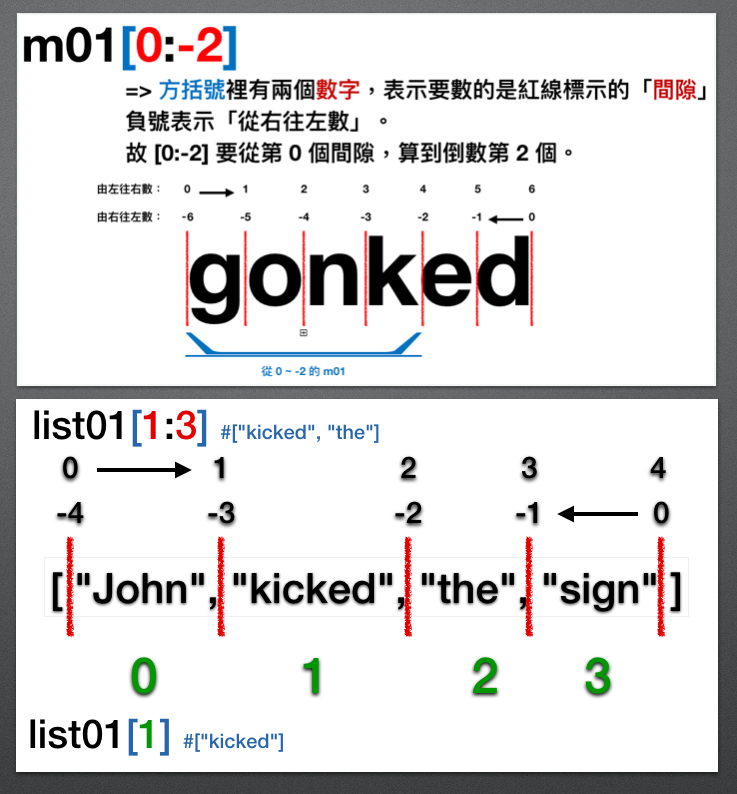

# Form: Data/Info in Languages
本系列的練習裡，將透過實際操作 Python 程式語言來理解「自然語言」裡的資料/資訊，在程式語言裡是如何呈現的。程式能力很像騎腳踏車或是游泳，如果你想確實掌握的話，一定要親手試試看哦！

如果在實作的過程中遇到任何問題，歡迎你到我們的 Discord 伺服器的 #nlp 頻道裡提問哦！
[連結：https://discord.gg/g5Enb5zAyK](https://discord.gg/g5Enb5zAyK)

## 練習目標：
Python 有幾個內建的資料型式 (data type)，分別詳列如下：
1. 「字串」(string type)
2. 「數字」(number type)
	- 整數型 (integer number, int)
	- 小數型 (floating number, float)
3. 「列表」(list type)
4. 「元組」(tuple type)
5. 「字典」(dictionary type)

本週的練習將會是從「字串」到「元組」之間的操作。乍看之下好像範圍很大，但其實它的操作思維是一致的。

我們可以將「資料型式 (data type)」當做是自然語言裡的「詞性」。就像名詞有自己的操作可以變化 (單數/複數；性別；格位)，字串型 (string) 也有自己的操作可以變化 (用 [:] 切分；用 + 串接；用 replace() 刪除內容)…等。

這個星期的內容，就像是認識「程式語言」裡的更多詞性。

## 說明：
在前幾週的 Discord 活動中已經提過，字串型會被引號包起來。不論是單引號、雙引號或是三層引號 (可為三層單引號或是三層雙引號)。

和字串型剛好相對的，就是數字型。

在電腦裡，整數和小數是不一樣的型別。我們可以透過 `type()` 這個內建的函式來檢視資料的型別。比如說…

```python
data01 = 5
data02 = 5.0
```
我們用 `type()` 來檢視它，就能得到…
```python
print(type(5))
<class 'int'>

print(type(5.0))
<class 'float'>
```
在輸出的結果裡， `'int'` 是 "integer"(整數) 的縮寫。表示 **data01** 是一個 `'int'` 型的資料。也就是說 **data01** 是整數。

而另一個結果裡，`'float'` 是 "floating number" (浮點數) 的縮寫。表示 **data02** 是一個 `'float'` 型的資料。白話文來講，就是 **data02** 是一個含有小數點的數字。

有時候，我們在做計算時，只需要算整數的位置，那麼我們就可以把小數點忽略而不理會。這時候我們可以利用 int() 這個函式的功能，做「轉型」的操作。比如說：

```python
data02 = 5.0
print(data02)
data03 = int(data02)   #我們把 data02 的 5.0 的值，透過 int() 來轉換型別，轉成 int 型
print(data03)
#得到 5 這個整數。
print(type(data03))
#得到 <class 'int'> 的結果。表示 data03 的確被轉成 int 的整數型別了。
```

這裡發生的事情，就像在自然語言裡，我們遇到一個詞彙在不同的句法樹位置裡會當做不同的詞性來使用一樣。比如說「機車」

> 一部**[機車]**
> 很**[機車]**

這裡發生的事情，就像是我們把「**`一部()`**」當成是像 **`int()`** 這樣的函式來使用，它會把後面的東西變成「名詞」；相對地，「**`很()`**」這個詞的功能就是把後面的詞彙轉成「形容詞/副詞」來使用。因此，在你大腦裡的語言系統裡，大概發生了像這樣的事情…

```
word01 = 機車(詞性_X)
word02 = 一部(word01)
print(word02) 
#得到  一部機車(詞性_noun) 的結果。於是你知道「機車」是名詞。

word03 = 很(word02)
print(word03)
#得到 很機車(詞性_adj/adv)  的結果。於是你知道「機車」是形容詞或副詞。
```

一般而言，NLP 的任務裡不太會需要處理數字，所以關於數字型資料的討論，我們先在這裡打住。如果你對數字很有興趣的話，可以繼續往這個方向探究一下 ([影片](https://realpython.com/lessons/floats/) )。這些數字型的資料操作，讓我們知道一件很重要的事：

### ！！！型別可以轉換！！！

既然型別可以轉換，那麼我們是不是可以利用已經熟悉的「字串型」來產生其它的型別呢？當然可以呀！


#### 列表 (list) 和 元組(tuple)
和「字串型(string)」會被引號夾起來一樣，**列表**和**元組**也各自需要被夾起來。用方括號夾起來的，是「列表 (list)」，而用圓括號夾起來的，是「元組 (tuple)」。我們一樣用 `type()` 來操作一下，看看它們的型別…

```python
list01 = ["John", "kicked", "the", "sign", 42]
tuple01 = ("John", "kicked", "the", "sign", 42)

print(type(list01))         #會得到 <class 'list'>
print(type(tuple01))    #會得到 <class 'tuple'>
```
乍看之下，會覺得列表 (list) 和元組 (tuple) 幾乎是一模一樣的。只差在一個是用方括號夾起來的 `[內容元素]` 而另一個是用圓括號夾起來的 `(內容元素)`。而且一樣地，不論是被夾成 list 還是被夾成 tuple，它們的「內容元素」是可以同時含有多個型別的。就像在前面的例子裡，我們在 `list01` 和 `tuple01` 裡同時放了字串型的 `"John"` 也放了數字型的 `42`。

其實這兩個型別，也的確有許多相似之處。用自然語言裡的詞性來比喻的話，就有點像「形容詞和副詞」的這種孿生關係。但是…它們還是有一個很根本的不同：

1. 列表 (list) 內的元素數量，**可以**增加或是減少。
2. 元組 (tuple) 內的元素數量，**不可以**增加，也**不可以**減少。

因此，列表 (list) 其實更像是我們學過的字串 (string) 的性質：

```python
list01 = ["John", "kicked", "the", "sign", 42]
print(list01)

#我們可以增加 list01 裡的內容元素
list01.append("then")     #在 list01 裡增加 "then"
list01.append("left.")     #在 list01 裡增加 "left."
print(list01)    #會得到內容元素增加的 list01

#也可以減少 list01 裡的內容元素
list01.remove(42)
print(list01)
```

但是，這樣增加與刪減的操作，在元組 (tuple) 裡是行不通的：

```python
tuple01 = ("John", "kicked", "the", "sign", 42)
print(tuple01)

#嚐試增加 tuple01 的內容
tuple01.append("then")  #這裡會導致 Python 的 AttributeError。因為 tuple 無法這樣操作。

#嚐試減少 tuple01 裡的內容
tuple01.remove(42)  #這裡會導致 Python 的 AttributeError。因為 tuple 無法這樣操作。
```

雖然列表 (list) 和元組 (tuple) 兩者在增加/刪減的操作上有所不同。前面也提到，它們有非常相同的地方，而且這兩者的相似之處，甚至和之前提過的字串型別 (string)也是一樣的。

簡單地說，這三者取「切分內容」的方式是一樣的：

```python
string01 = "John kicked the sign and left."
list01 = ["John", "kicked", "the", "sign", "and", "left."]
tuple01 = ("John", "kicked", "the", "sign", "and", "left.")

verbFromSTR = string01[5:11]
print(verbFromSTR)   #取出一個 string 型別的結果

verbFromLIST = list01[1:2]
print(verbFromLIST)    #取出一個 list 型別的結果

verbFromTUPLE = tuple01[1:2]
print(verbFromTUPLE)  #取出一個 tuple 型別的結果
```

這三者的共通點都是，如果一個方括號 `[ A:B]` 放著 **A** 和 **B** 兩個數字的話，它就會計算「間隔」。

同理，如果一個方括號裡只放著一個數字的話，像這樣 `[N]`只放著 **N** 這個數字，那麼它會從 0 開始算，算到第 **N** 個元素：

```python
string01 = "John kicked the sign and left."
list01 = ["John", "kicked", "the", "sign", "and", "left."]
tuple01 = ("John", "kicked", "the", "sign", "and", "left.")

verbFromSTR = string01[5]
print(verbFromSTR)   #取出一個 string 型別的結果，結果為 "k"

verbFromLIST = list01[1]
print(verbFromLIST)    #取出一個 list 型別的結果，結果為 ["kicked"]

verbFromTUPLE = tuple01[1]
print(verbFromTUPLE)  #取出一個 tuple 型別的結果，結果為 ("kicked")
```

從第一週的操作講到現在的第四週，我們透過語言學的知識和 Python 程式語言的操作，結合了很多「自然語言」和「程式語言」之間的類比。最後，我們還是要來聊聊「轉品/轉型」的問題！

我們在第一週的作業裡，談到如何去檢查 **glonked** 是不是一個動詞的字的時候，我們處理的對象就是語言裡的「詞彙」。接著，在第二週裡，我們試著利用 `[ ]` 方括號的切分 (slicing) 操作，來把 **glonked** 裡的 **-ed** 移除。接著在第三週的操作裡，我們示範了如何完整地把這些操作放到各自獨立的函式 (function) 裡，以便規劃程式的運作邏輯。

### 但我們一直沒講明的是，在一個「字串 (string)」裡面，電腦是怎麼知道怎麼樣算是一個「詞彙」的呢？

答案很簡單：「電腦不知道！」

電腦不是人，它沒有內建人類語言的解析機制，因此它不知道什麼才是一個詞彙。我們在後面的討論裡，會再把這個議題放上檯面來仔細討論。在那之前，我們可以先注意到的是，就一個字串 (string) 和一個列表 (list) 而言，列表的內容「比較像是把各別詞彙分開放置」的模樣。

簡單地說，如果能有一個方法把「字串(string) 轉為列表 (list)，而且是一個詞彙一個詞彙地分開，那該有多好呢。」

這樣的操作需求，在 Python 裡可以透過 `split()` 達到！具體的做法是這樣：

```python
string01 = "John kicked the sign and left."
list01 = string01.split(" ")  #把 string01 利用 .split() 切開。切開的依據是「空格」。

print(list01) #結果應為 ['John', 'kicked', 'the', 'sign', 'and', 'left.']
```

當然 `.split()` 並不是「一定要用空格切」，你也可以試試看用 "e" 來切：

```python
string01 = "John kicked the sign and left."
list01 = string01.split("e")  #把 string01 利用 .split() 切開。切開的依據是 "e"。

print(list01) #結果應為 ['John kick', 'd th', ' sign and l', 'ft.']
```

在上面的測試裡，就能發現只要是字母 "**e**" 的地方，都被切開成為斷點。而原本的 string01 的字串(string) 內容，則因為 `.split()` 的操作，變成了一個列表 (list) 型的資料了。這項操作在後續的 NLP 任務中會很常用到。請務必多多練習！

## 練習 w04_01：
> 下列的德文句子裡，動詞是最後一個字。請利用 `.split()` 和 `[ ]` 取出句子裡的德文動詞！
Ich kann den Mann sehen.
Ich sah einen Mann, der einen Apfel aß.

```python
#!/usr/bin/env python3
# -*- coding:utf-8 -*-

def main(inputSTR=""):
    #<在此行以下設計你的程式。別忘了把答案透過 return 做回傳哦！>
    return None
    
if __name__ == "__main__":
    inputSTR01 = "Ich kann den Mann sehen."
    answerSTR = main(inputSTR=)
    print("第一句的動詞為：{}".format(answerSTR))
    
    inputSTR02 = "Ich sah einen Mann, der einen Apfel aß."
    answerSTR = main(inputSTR=)
    print("第二句的動詞為：{}".format(answerSTR))
```
